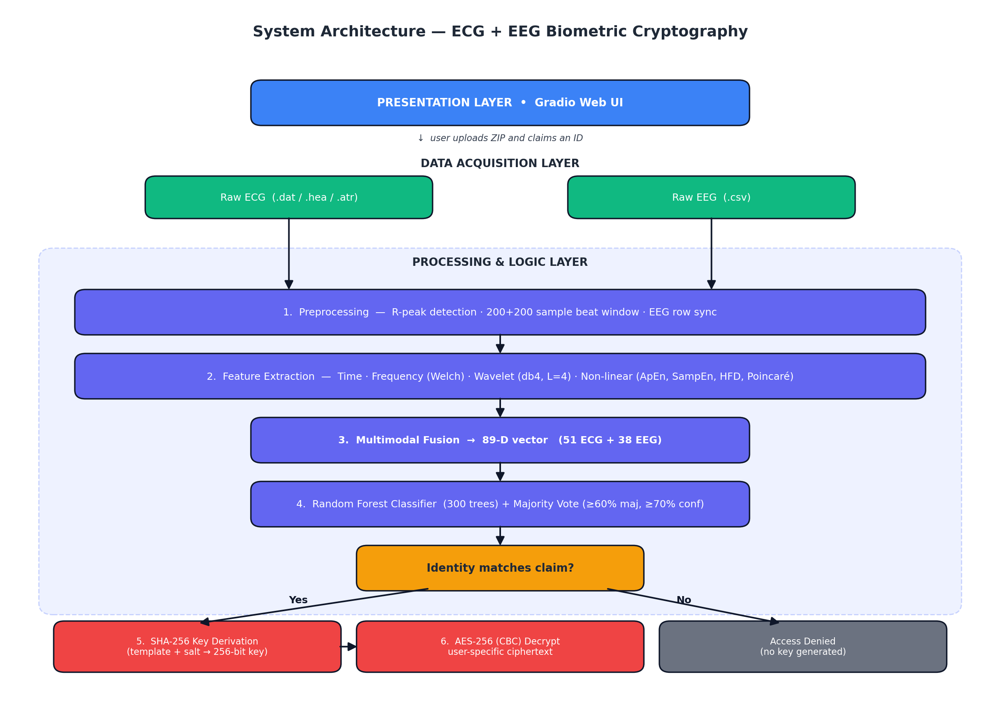
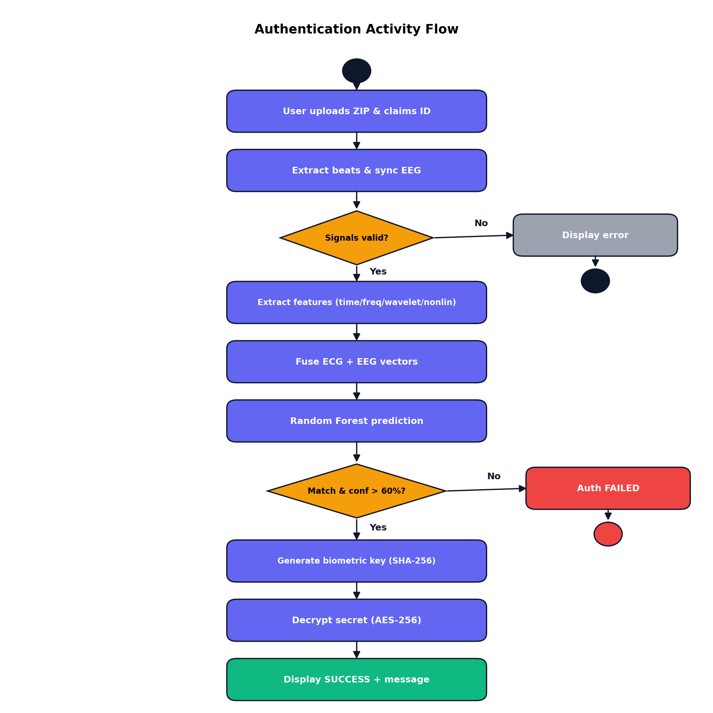
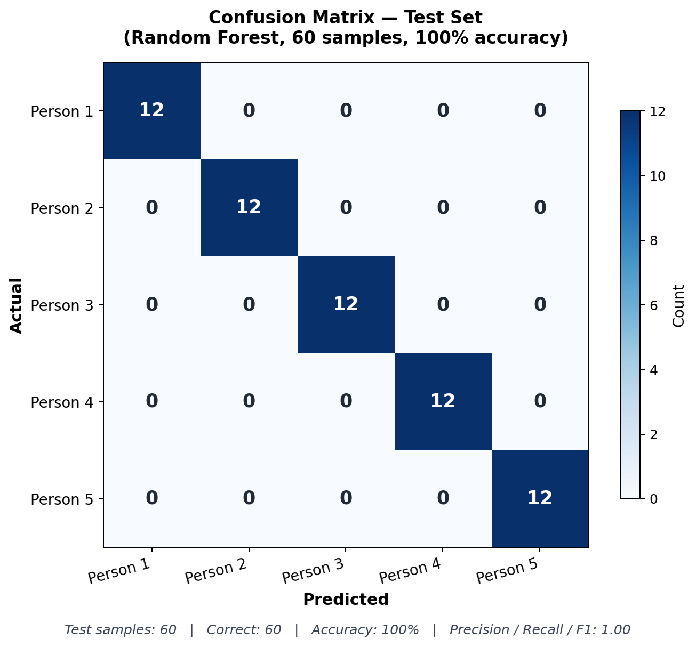
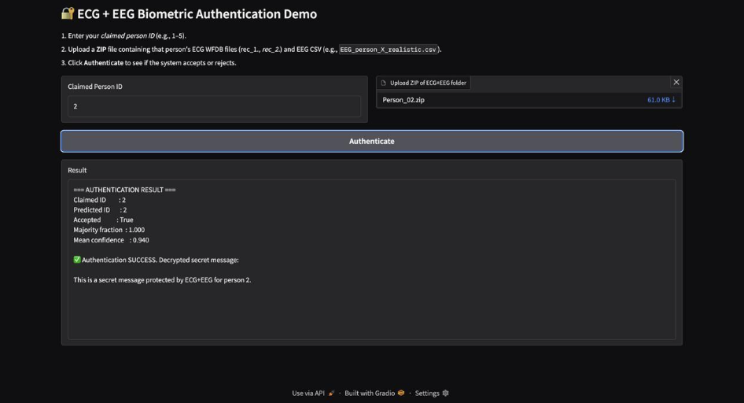
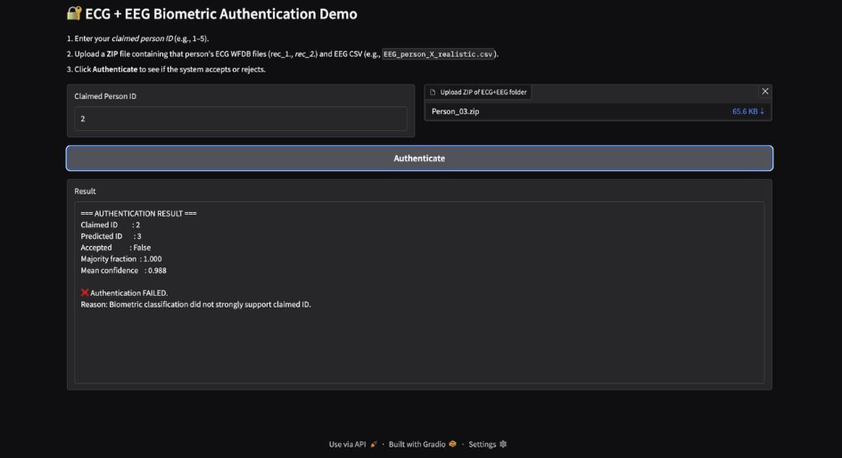
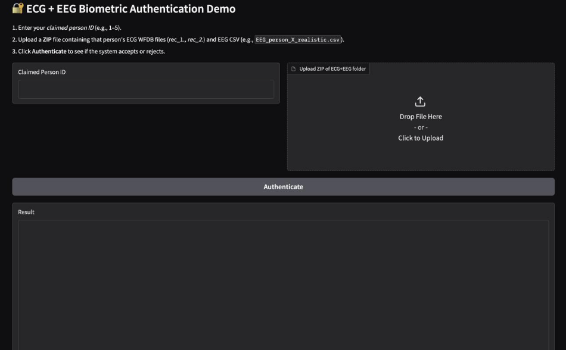

# ECG + EEG Based Biometric Cryptography Using Machine Learning

> A multimodal biometric authentication and cryptographic system that uses the physiological uniqueness of ECG (Electrocardiogram) and EEG (Electroencephalogram) signals to verify identity and dynamically generate AES-256 encryption keys — eliminating the need for stored passwords or static keys.


---

## Table of Contents

- [Motivation](#motivation)
- [Key Contributions](#key-contributions)
- [System Architecture](#system-architecture)
- [Methodology](#methodology)
- [Results](#results)
- [Demo](#demo)
- [Repository Structure](#repository-structure)
- [Tech Stack](#tech-stack)
- [How to Run](#how-to-run)
- [Limitations](#limitations)
- [Future Work](#future-work)
- [Ethics and Privacy](#ethics-and-privacy)
- [Authors](#authors)
- [Acknowledgments](#acknowledgments)
- [References](#references)
- [Citation](#citation)
- [License](#license)

---

## Motivation

Traditional authentication systems — passwords, PINs, tokens — can be stolen, leaked, or replicated. Even widely deployed biometrics like fingerprints and facial recognition are vulnerable to spoofing (lifted prints, 3D masks, high-resolution photos), and the templates, once leaked, cannot be reset.

Equally important, most existing systems treat **identity verification** and **data encryption** as separate processes: a user logs in, then encryption keys are retrieved from a database. If the database is compromised, the keys are exposed.

This project addresses both gaps by building a system where:

1. Internal physiological signals (ECG and EEG) serve as the biometric — they inherently embed *liveness* because they originate from real-time cardiac and neural activity, making them very difficult to forge.
2. The cryptographic key is derived dynamically from the user's biometric template — if the user is not present, the key does not exist.

## Key Contributions

- **Multimodal feature-level fusion** of ECG and EEG signals using time, frequency, wavelet (Daubechies db4), and non-linear (Approximate Entropy, Sample Entropy, Higuchi Fractal Dimension, Poincaré) features — yielding an 89-dimensional unified biometric template per heartbeat.
- **Random Forest classifier with majority voting** over a session of beats, gated by a confidence threshold (60% majority + 70% mean confidence) for robust identity verification.
- **Biometric-driven AES-256 cryptosystem** in CBC mode, with the 256-bit key derived via SHA-256 hashing of the per-user mean biometric template plus a fixed salt.
- **End-to-end Gradio web prototype** that accepts a ZIP of ECG (WFDB) + EEG (CSV) files, performs authentication, and decrypts a per-user secret message on success.

---

## System Architecture

The system follows a modular pipeline-based design with three primary layers: a Data Acquisition Layer that ingests raw signals, a Processing & Logic Layer that handles feature extraction, fusion, classification, and cryptography, and a Presentation Layer built on Gradio.



### Authentication Flow



---

## Methodology

The pipeline consists of six phases:

**1. Signal acquisition and preprocessing.** ECG records (WFDB format: `.dat`, `.hea`) are read using the `wfdb` library; R-peaks are detected via the annotation channel. Each beat is segmented as a fixed window of 200 samples before and 200 samples after the R-peak (400 samples total at 500 Hz sampling rate). Boundary beats are zero-padded to maintain a consistent input shape. EEG data (CSV) is synchronized to match the number of extracted ECG beats by truncation or repetition.

**2. Feature extraction.** Four feature families are computed per beat:
- *Time domain* (15 features): mean, std, variance, median, max, min, peak-to-peak, RMS, energy, zero-crossing rate, derivative statistics, R-amplitude, pre/post slopes around the R-peak.
- *Frequency domain* (10 features, via Welch's method): total power, dominant frequency, band powers (0–5 Hz, 5–15 Hz, 15–40 Hz), spectral centroid, mean/median frequency, spectral entropy, spectral flatness.
- *Wavelet domain* (20 features, Daubechies db4 at level 4): mean, variance, energy, and entropy of each of 5 sub-bands.
- *Non-linear* (6 features): Approximate Entropy, Sample Entropy, Higuchi Fractal Dimension, and Poincaré (SD1, SD2, ratio) over RR intervals.

ECG yields 51 features per beat; EEG contributes 38 pre-computed features. Feature-level fusion via horizontal concatenation produces an **89-dimensional template** per beat.

**3. Model training.** A Random Forest classifier (`n_estimators=300`, `random_state=42`) is trained on a 70/30 stratified split. Random Forest was chosen for its robustness to high-dimensional features, implicit feature selection, and resistance to overfitting on small datasets.

**4. Authentication via majority voting.** During verification, every beat in the session is classified independently. The session is accepted only if the majority predicted class matches the claimed ID, the majority fraction ≥ 0.6, *and* the mean classifier confidence ≥ 0.7.

**5. Biometric key generation.** On successful authentication, the per-user mean biometric template is normalized to `[0, 255]`, cast to bytes, concatenated with a fixed salt (`ECG_EEG_BIOMETRIC_SALT`), and hashed with SHA-256 to produce a deterministic 256-bit key.

**6. Cryptography.** A pre-encrypted user-specific message is decrypted using AES-256 in CBC mode with the regenerated key. If authentication fails, the key is never derived and the ciphertext remains opaque.

---

## Results

The system was evaluated on a 5-subject ECG + EEG dataset (40 beats per subject, 200 samples total) with a 70/30 stratified train-test split.

### Classification Performance

| Metric | Value |
| --- | --- |
| Training samples | 140 beats |
| Testing samples | 60 beats |
| Test accuracy | **100%** (60/60 correctly classified) |
| Classifier | Random Forest (300 trees) |
| Feature dimension | 89 (51 ECG + 38 EEG) |
| Mean inference confidence | 0.94 |



### Cryptographic Outcome

| Property | Value |
| --- | --- |
| Key length | 256 bits (32 bytes) |
| Hashing | SHA-256 with per-system salt |
| Encryption | AES-256, CBC mode |
| Key storage | None — regenerated on the fly from the biometric template |
| End-to-end pipeline latency | < 5 seconds per session (Google Colab CPU) |

On successful authentication of, for example, *Person 2*, the system successfully decrypted the ciphertext to:

> *"This is a secret message protected by ECG+EEG for person 2."*

When an imposter attempted authentication (claimed ID 2, biometric data from Person 3), the system correctly denied access with `Accepted: False`, `Majority fraction: 1.000`, indicating the predicted ID did not match the claim.

> **Important caveat on the 100% figure.** This result is on a small (5-subject), within-session dataset and should be interpreted as a proof-of-concept of the multimodal fusion + cryptography pipeline, *not* a generalizable accuracy claim. See [Limitations](#limitations).

---

## Demo

A Gradio web interface allows the user to enter a claimed person ID and upload a ZIP containing their ECG (WFDB) + EEG (CSV) files, then receive an authentication decision and (on success) the decrypted message.

| | |
|---|---|
| **Successful authentication** | **Failed authentication (imposter)** |
|  |  |

The interface itself:



---

## Repository Structure

```
ECG-EEG-Biometric-Cryptography/
├── README.md
├── LICENSE
├── requirements.txt
├── ecg_eeg_biometric_pipeline.ipynb   # Main notebook — full pipeline + Gradio
├── docs/
│   ├── project_report.pdf             # Full academic report
│   ├── architecture.png
│   ├── activity_diagram.png
│   ├── use_case_diagram.png
│   └── confusion_matrix.png
├── screenshots/
│   ├── gradio_interface.png
│   ├── auth_success.png
│   └── auth_failed.png
└── data/
    └── README.md                      # Dataset description and download instructions
```

---

## Tech Stack

- **Language:** Python 3.10+
- **Signal processing:** `wfdb`, `scipy`, `numpy`
- **Wavelets:** `pywavelets`
- **Machine learning:** `scikit-learn`
- **Cryptography:** `pycryptodome`
- **UI:** `gradio`
- **Environment:** Google Colab (Jupyter notebook)

---

## How to Run

**1. Clone the repository**

```bash
git clone https://github.com/Chiranthan7/ECG-and-EEG-based-Biometric-Encryption-using-Machine-Learning.git
cd ECG-and-EEG-based-Biometric-Encryption-using-Machine-Learning
```

**2. Install dependencies**

```bash
pip install -r requirements.txt
```

**3. Prepare the dataset**

The dataset zip in this repository contains 5 subjects' ECG (WFDB format) and EEG (CSV) files. Extract it to a local directory and update the `BASE_DIR` constant in the notebook to point at it. See [`data/README.md`](data/README.md) for the expected folder layout.

**4. Run the notebook**

Open `ecg_eeg_biometric_pipeline.ipynb` in Jupyter or Google Colab and execute cells sequentially. The final cell launches the Gradio interface; click the local URL to interact.

**5. Authenticate**

In the Gradio UI:
- Enter a claimed person ID (1–5)
- Upload a ZIP containing that person's ECG WFDB files (e.g., `rec_1.*`, `rec_2.*`) and EEG CSV (e.g., `EEG_person_2_realistic.csv`)
- Click **Authenticate** to see the result and (on success) the decrypted message

---

## Limitations

The authors believe transparent disclosure of limitations is essential, especially in a security-related project:

- **Small dataset.** The system is evaluated on 5 subjects with 40 beats each — sufficient for proof-of-concept but not for population-level claims. Realistic deployment requires evaluation on benchmark datasets such as PhysioNet ECG-ID, PTB, MIT-BIH (for ECG) and BED, DEAP, or PhysioNet EEG Motor/Mental (for EEG), each with tens to hundreds of subjects.
- **Within-session evaluation only.** Train and test beats come from the same recording session. Cross-session and cross-day evaluation — where physiological state drift is real — would be a stronger test. This is standard in the biometrics literature.
- **Identification metrics rather than verification metrics.** Accuracy is reported here; production biometric systems are characterized by False Accept Rate (FAR), False Rejection Rate (FRR), and Equal Error Rate (EER) over ROC/DET curves. These are appropriate next-step metrics.
- **The cryptographic scheme uses a stored reference template.** Truly noise-tolerant biometric key generation requires *fuzzy extractors* (Dodis et al.), *fuzzy commitments*, or *secure sketches*, which can regenerate the exact key from a noisy live measurement without storing the template. The current system stores the per-user mean template, which works as a prototype but is not a true biometric cryptosystem in the cryptographic sense.
- **AES-CBC is unauthenticated.** A production system would use AES-GCM or AES-CBC + HMAC to defend against ciphertext tampering.
- **No presentation attack detection (PAD).** While ECG/EEG are harder to spoof than fingerprints, a defensive deployment would include explicit liveness checks (e.g., heart-rate variability sanity, signal quality indices).
- **Cancelability.** Biometric templates cannot be reset if compromised. Future work should integrate cancelable-biometric techniques such as random projection, BioHashing, or salting within a fuzzy extractor framework so a leaked template can be revoked and reissued.

---

## Future Work

- **Deep learning feature extraction.** Replace handcrafted features with end-to-end 1D CNN, LSTM, or hybrid CNN-LSTM models trained on raw signals.
- **Fuzzy extractor integration.** Replace the current SHA-256-of-template scheme with a proper fuzzy extractor or secure-sketch construction so the exact key can be regenerated from noisy live signals without storing the template.
- **Real-time hardware deployment.** Port the trained model to embedded edge devices (Raspberry Pi, NVIDIA Jetson) integrated with consumer ECG/EEG sensors (AD8232, OpenBCI) for live authentication.
- **Continuous authentication.** Move beyond static login to background continuous verification using a wrist-worn sensor, locking the session if the wearer changes.
- **Larger and cross-session benchmarks.** Evaluate on full PhysioNet databases with 50+ subjects and report FAR / FRR / EER over multiple sessions and days.
- **Threat model formalization.** Explicit defenses against replay, presentation, template inversion, hill-climbing, and cross-matching attacks.

---

## Ethics and Privacy

ECG and EEG signals are health-related biometric data and require careful handling:

- **Informed consent.** Any future data collection for this system must follow IRB / ethics-committee-approved consent protocols, with subjects informed about how their physiological data will be stored, processed, and (eventually) deleted.
- **Data minimization.** Only the features needed for authentication should be retained; raw signals should not be persisted longer than necessary for model training.
- **Template protection.** Because biometrics cannot be reset like passwords, future versions should integrate cancelable-biometric schemes (random projection, BioHashing, fuzzy extractors with per-user salts) so a leaked template can be revoked.
- **No medical inference.** This system is designed for authentication; ECG/EEG signals also carry medical information (arrhythmia indicators, neurological markers). Any deployment must strictly separate authentication features from medical inference and comply with applicable health-data regulations (HIPAA, GDPR, India's DPDPA).

---

## Authors

This work was carried out as part of the *Project Work – 2* course (Course Code: 24AM7PWPW2) for the 7th semester of the B.E. in Artificial Intelligence and Machine Learning programme at **B.M.S. College of Engineering**, Bengaluru, an Autonomous Institute affiliated with Visvesvaraya Technological University (VTU), Belagavi.

| Name | USN | Role |
| --- | --- | --- |
| **C M Chiranthan Gowda** | 1BM22AI035 | Team Lead |
| Anand Naik H | 1BM22AI013 | Team Member |
| Amogh G | 1BM22AI011 | Team Member |
| Om Arya B S | 1BM22AI086 | Team Member |

**Project guide:** Prof. Spoorthi G S, Assistant Professor, Department of Machine Learning, BMSCE.

---

## Acknowledgments

The authors thank Prof. Spoorthi G S for her guidance throughout the project, Dr. M. Dakshayini (Professor and Head, Department of Machine Learning, BMSCE) for her valuable suggestions, and Dr. Bheemsha Arya (Principal, BMSCE) for providing the facilities and academic environment that made this work possible. The authors also acknowledge the PhysioNet community for the WFDB tooling that underpins the ECG processing pipeline.

---

## References

1. A. Abadleh, S. Al-Sarayrah, and M. Al-Fayoumi, "ECG-Based Biometric Key Generation Using Principal Component Analysis and Random Forest," *IEEE Access*, vol. 13, pp. 10245–10258, 2025.
2. H. M. Lynn, S. B. Pan, and P. Kim, "A Deep Learning-Based Approach for ECG-Based Biometric Authentication," *Journal of Ambient Intelligence and Humanized Computing*, vol. 11, no. 11, pp. 4821–4831, 2020.
3. M. Nabil, M. Ismail, and M. I. Sezan, "Robust ECG Identification Using Deep Learning with Noise Filtering Mechanisms," *Expert Systems with Applications*, vol. 238, p. 121803, 2024.
4. A. Tahaci, S. K. Bashar, and A. S. Al-Mogren, "EEG-Based Person Identification Using Deep Convolutional Neural Networks and Time-Frequency Features," *IEEE Transactions on Instrumentation and Measurement*, vol. 72, pp. 1–12, 2023.
5. H. J. Bidgoly, H. Jalalvand, and M. A. Pourmina, "A Survey of EEG-Based Biometry: Features, Classifiers, and Applications," *IEEE Systems Journal*, vol. 14, no. 3, pp. 3671–3682, 2020.
6. S. K. Bashar, M. I. H. Bhuiyan, and A. D. McDonald, "Multimodal Biometric Authentication Using Fusion of ECG and EEG Signals," *Biomedical Signal Processing and Control*, vol. 54, p. 101614, 2019.
7. A. Rattani and M. Derakhshani, "Multimodal Biometrics: A Review of Fusion Strategies and Applications," *Information Fusion*, vol. 52, pp. 1–14, 2019.
8. G. Kaur, R. P. Singh, and S. H. Lee, "A Novel Biometric Cryptosystem Based on ECG Signals for Secure Internet of Things," *Future Generation Computer Systems*, vol. 115, pp. 450–462, 2021.
9. Y. Zhang, L. Wu, and J. Wang, "Brainwave-Based Key Generation: Securing Wireless Communication with EEG Signals," *IEEE Internet of Things Journal*, vol. 10, no. 4, pp. 3012–3024, 2023.
10. L. Breiman, "Random Forests," *Machine Learning*, vol. 45, no. 1, pp. 5–32, 2001.
11. J. Daemen and V. Rijmen, *The Design of Rijndael: AES — The Advanced Encryption Standard*, Springer-Verlag, 2002.
12. G. Moody, R. Mark, and A. Goldberger, "PhysioNet: A Web-Based Resource for the Study of Physiologic Signals," *IEEE Engineering in Medicine and Biology Magazine*, vol. 20, no. 3, pp. 70–75, 2001.

---

## Citation

If you use this work or build upon it, please cite:

```bibtex
@misc{chiranthan2025ecgeeg,
  title        = {ECG and EEG Based Biometric Cryptography Using Machine Learning},
  author       = {Chiranthan Gowda, C M and Naik H, Anand and G, Amogh and Arya B S, Om},
  year         = {2025},
  institution  = {B.M.S. College of Engineering, Bengaluru},
  howpublished = {\url{https://github.com/Chiranthan7/ECG-and-EEG-based-Biometric-Encryption-using-Machine-Learning}},
  note         = {Project Work — 2, B.E. in Artificial Intelligence and Machine Learning, Semester 7}
}
```

---

## License

This project is released under the [MIT License](LICENSE). The included dataset is for academic and research purposes only.
